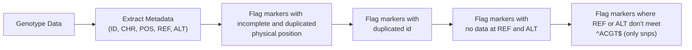
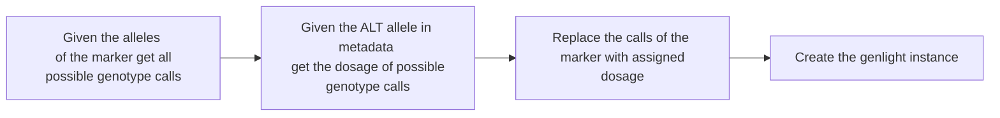

# CGIAR Genomics

This R package was designed to facilitate the reading, filtering and post-processing of genetic data of diploid and polyploid bi-allelic single nucleotide polymorphisms (SNP) makers. The software has been developed and tested with data from CGIAR research centers. 

## Installation

```R
install.packages("devtools")
library(devtools)
install_github("Breeding-Analytics/cgiarGenomics")
library(cgiarGenomics)
```

## Data preparation

The user has the option of load the genotypic information using the following formats:
- Hapmap (diploid & polyploid support)
- VCF (diploid & polyploid support)
- DartSeq SNP (only diploid support)
- DartTag (counts and dosage file)

### Genotype reading process

On its core the package wants to convert the marker data into an [genlight](https://github.com/thibautjombart/adegenet) instance. This because genlight internally codes chunks of 8 SNPs using a single byte, resulting in drastic compression of the data. Support any ploidity level.

To perform the instantiation of a genlight object its necessary provide the allelic dosage matrix of only bi-allelic SNPs for this reason is necessary first filter all the variants that doesn't meet this requierment. For doing so, is mandatory the allelic information (ref and alt alleles) and the physical position (Chromosome, position). Here a general flowchart of the reading process. 



Flaged markers are removed and are kept only the bi-allelic snps and here is the flowchart to get the dosage matrix to produce the genlight instance:



### Hapmap 
Use the following examples to format your hapmap file. 
#### Code	Meaning
A	Adenine
C	Cytosine
G	Guanine
T	Thymine
#### Diploid example
| rs#   | alleles | chrom | pos      | strand | assembly# | center | protLSID | assayLSID | panelLSID | QCcode | sample_1 |
|-------|---------|--------|----------|--------|-----------|--------|----------|-----------|-----------|--------|------------|
| 44509 | A/G     | Chr02  | 5565755  | NA     | NA        | NA     | NA       | NA        | NA        | NA     | AG         |

#### Tetraploid example
| rs#   | alleles | chrom | pos      | strand | assembly# | center | protLSID | assayLSID | panelLSID | QCcode | sample_1 |
|-------|---------|--------|----------|--------|-----------|--------|----------|-----------|-----------|--------|------------|
| 44509 | A/G     | Chr02  | 5565755  | NA     | NA        | NA     | NA       | NA        | NA        | NA     | AAGG       |

#### Notes
The alleles column should always be separated with "/"

### VCF
#### Diploid example
| #CHROM | POS     | ID        | REF | ALT | QUAL | FILTER | INFO            | FORMAT | sample_1 |
|--------|---------|-----------|-----|-----|------|--------|-----------------|--------|----------|
| Chr01      | 120931  | S1_120931 | C   | A   | .    | PASS   | AC=25;AN=1560   | GT     | 0/0      |

#### Tetraploid example
| #CHROM | POS     | ID                   | REF | ALT | QUAL | FILTER | INFO                           | FORMAT            | sample_1               |
|--------|---------|----------------------|-----|-----|------|--------|--------------------------------|-------------------|------------------------|
| Chr01  | 510745  | solcap_snp_c2_36615  | T   | G   | .    | .      | NS=367;DP.AVG=65.6;AF=0.26     | GT:AD:DP          | 0/0/0/1:47,9:56        |

### DArT Seq SNP

Standard DArT Seq SNPs format delivered by Diversity arrays. We use the [DartR](https://green-striped-gecko.github.io/dartR/) function named gl.read.dart to load those files.

### DArT Tag (Polyploid)

Two files are expected, counts.file and dosage file. We use the function dart2vcf of [polyBreedR](https://github.com/jendelman/polyBreedR) package.